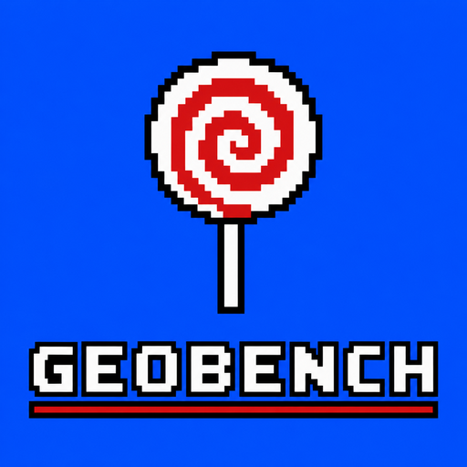
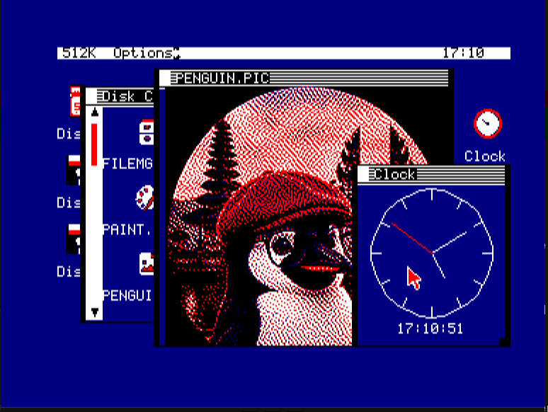

<p align="center">
  
</p>

# GEOBENCH

A graphical desktop environment for the **Amstrad CPC** and the **MSX2** — a
hybrid clone that borrows the best ideas from **Commodore GEOS** (C64/C128) and
the **Amiga Workbench**, reimagined for 8-bit Z80 hardware.



A resident Z80 **kernel** owns the machine and exposes a fixed jump-table API; the
**apps are written in C** (SDCC) and run co-resident in expansion-bank pages,
reaching the kernel through `libgb`. It's a graphical layer on top of an existing
DOS (AMSDOS / UniDOS / MSX-DOS 2), not a replacement OS — smaller scope than
[SymbOS](https://www.symbos.de), different goal.

The desktop, file manager, Notepad, ICONED, Paint, Viewer, Clock, Telnet, Xaos,
Settings and a set of screensavers all build from one script. The same source tree
targets **two platforms**: the CPC (Albireo card + AMSDOS floppy) and the
[MSX2](docs/MSX2.md) (MSX-DOS 2 / Nextor, V9938 Screen 6).

## Quick start

Builds happen inside the project distrobox (RASM + SDCC + `mtools` on `PATH`). The
staged media under `QA/` are committed, so you can run without building first.

```bash
# Amstrad CPC — build + run the floppy in the 1984 emulator
bash tools/build_kernel.sh
1984 --memory=128 --disk-a=QA/GEOBENCH.DSK --autostart=GB

# MSX2 — build + run in openMSX
bash tools/fetch_msx_deps.sh       # one-time: Nextor + NMS 8250 ROMs
bash tools/build_kernel_msx.sh
tools/run_msx.sh
```

Boot with `RUN"GB`. Full details — card images, the M4 board, the optional ROM —
are in [docs/BUILDING.md](docs/BUILDING.md).

## Documentation

- **[About](docs/ABOUT.md)** — what GEOBENCH is, why, how it works, design
  inspirations, target hardware, goals and non-goals, project layout.
- **[Features](docs/FEATURES.md)** — what works today, with screenshots.
- **[Building & running](docs/BUILDING.md)** — the CPC build, deploy targets, the
  optional GEOBENCH ROM.
- **[The MSX2 target](docs/MSX2.md)** — the second platform: `GBMSX.COM`, Screen 6,
  the openMSX harness.
- **[Roadmap](docs/ROADMAP.md)** — what's done and what's next.

## Where it's going

The core desktop, windowing, file manager, C app model and a suite of bundled apps
all work on both platforms. Next up: a single canonical asset format shared across
CPC and MSX, resizable Paint canvases, drawers/folders, and per-screensaver
configuration. See the [roadmap](docs/ROADMAP.md) for the full list.

## License

BSD 3-Clause License. See [`LICENSE`](LICENSE).
