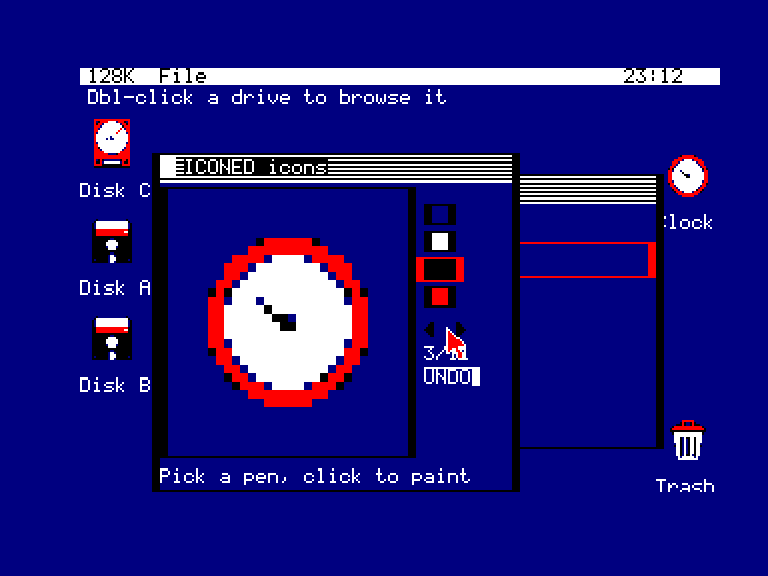
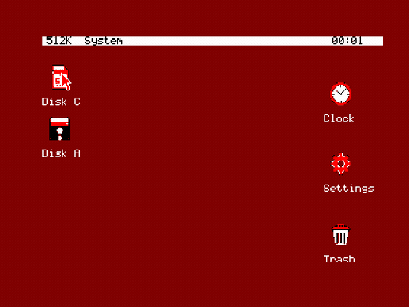

<p align="center">
  
</p>

# GEOBENCH

A graphical desktop environment for the **Amstrad CPC** — a hybrid clone that
borrows the best ideas from **Commodore GEOS** (C64/C128) and the **Amiga
Workbench**, reimagined for 8-bit Z80 hardware.

> **Status:** a working **banked multi-app micro-OS** for 128K+ CPCs. A resident
> Z80 **kernel** owns the machine and exposes a fixed jump-table API; the
> **apps are written in C** (SDCC) and run co-resident in expansion-bank pages,
> reaching the kernel through `libgb`. The shipped target is the **Albireo card**
> plus the **AMSDOS floppy fallback**; the tree also carries a bootable floppy
> pair (`QA/GEOBENCH.DSK` + `QA/COMPANION.DSK`). The desktop, file manager,
> Notepad, ICONED, Paint, Viewer, Clock, Telnet, Xaos, Settings, and the saver
> set all build from `tools/build_kernel.sh`.

## Visual target

The long-term look we're aiming for — an Amiga Workbench-style desktop as it
might have existed on the CPC: labelled drawer/app icons, windows with title
bars and gadgets, a trashcan, an arrow pointer.


> Image: a screenshot from The 8-Bit Guy's video on the **C128 "Alternate
> Universe"** — used here purely as a visual reference for the look we're after.

We're a long way from this, but it's the north star.

### Where it is now

The current GEOBENCH desktop running on the Amstrad CPC (1984 emulator): a Mode 1
backdrop, a top bar showing total RAM and a clock, and draggable multicolour
bitmap icons (Disk, Clock, Trash) driven by a joystick (or AMX mouse) / keyboard pointer.


The ICONED icon/cursor editor open on a `.IST` set (magnified canvas, pen palette,
Prev/Next, UNDO) over a File Manager window — all co-resident under the kernel WM:



Several apps running at once: the File Manager (sorted listing), the Viewer showing
`PENGUIN.PIC` (a photo converted with `tools/picconv.py`), and the analog Clock —
all co-resident windows under the kernel window manager:


A short capture of GEOBENCH running in the 1984 emulator — the desktop, a patterned
backdrop, dragging icons, opening apps and menus:



What works today:

- **Desktop** — a selectable **patterned backdrop** (a repeating 16×16 Mode-1 tile
  via `BACKDROP=`, or a plain colour), top bar (RAM probe + clock), draggable
  labelled icons that erase cleanly back to the pattern, a System menu (Ram Usage /
  Refresh Media / Tidy Icons / Settings / Activate screensaver / Exit to DOS).
  Settings opens from the System menu — it no longer needs its own desktop icon.
- **File manager** — double-click the Disk icon to open a window listing the
  drive; a type icon + name per file (**list** or **icon** view), entries **sorted
  by type then alphabetically**, a **scrolling** list, click to select, double-click
  to open (routed to the right app by a type→app table). A **`..` entry** (with an
  up-arrow icon) goes up a directory; a **View** menu toggles list/icons and
  maximises the window. Multi-drive, drag-and-drop, a Trash.
- **Notepad** — a text editor: type/edit, word-wrap, click or cursor keys to place
  the caret, **File / Edit / View** menus (New/Load/Save/Save As, copy/paste,
  Fullscreen). Saves `.BAS` with CR+LF so CPC BASIC can load them.
- **ICONED** — an icon/cursor editor for `.IST` sets and `.SPR` cursors (magnified
  canvas, pen palette, Prev/Next, undo, New/Load/Save/Save As, View > Fullscreen).
- **Paint** — a Mode-1 paint app: a canvas + toolchest (pencil, square, circle,
  flood fill, undo), a 4-ink palette and pencil width, New/Load/Save to the `.PIC`
  format (a versioned bitmap with its own size + palette), View > Fullscreen. Tool
  icons are a normal `.IST` set, editable in ICONED.
- **Viewer** — open any file to peek at it: word-wrapped text, or a `.PIC` image
  rendered to a window sized to the picture. File > Load opens another file, View >
  Fullscreen maximises. Draggable, resizeable. A large picture (over ~8.5 KB, i.e.
  bigger than the in-window buffer) is loaded into a borrowed 16 KB RAM bank, so on a
  bare 128K machine — where the desktop, file manager and viewer already use every
  app bank — a big image shows an empty window; a 256K+ expansion (any spare bank)
  displays it. Small pictures always work.
- **Clock** — an analog clock window (Dallas RTC, else software); View > Fullscreen
  rescales the face to the whole screen, an Options menu sets the time / toggles seconds.
- **Settings** — a control panel for `GEOBENCH.CFG`: pick the **font** (`.FNT`),
  **icon set** (`.IST`), **cursor** (`.SPR`), **backdrop** pattern (`.BDP`, or
  `SOLID`) and a centred **wallpaper** (`.PIC`) from the system folder, a **Colours**
  editor for the 4 Mode-1 pens + the screen border (`INKS=`) with a **live** preview
  — `-`/`+` recolours the whole desktop instantly — and a **Screensaver** section
  (**Module** picker + idle **Timeout**). Media settings are now stored as
  **drive-qualified names** such as `A:DARKER` or `C:XMATRIX`, so Settings can
  browse either floppy or Albireo content without ambiguity. Invalid media now
  falls back safely to `SOLID` / `NONE` at boot instead of blocking startup. The
  icon-set picker can **filter by icon count**. Launches from the System menu.
- **Screensavers** — self-contained apps shipped with a `.SAV` extension. The
  desktop's idle timer (global, so it fires over any app) launches the configured
  module after the timeout; any pointer move / click / key returns to the desktop.
  Ships **CIRCLE** (random circles), **DECO** (Art-Deco panels), **XMATRIX**
  (binary "Matrix" rain) and **MOUNTAIN** (isometric 3D terrain) on both disks, plus
  several **Albireo-card-only** extras: **FRACTALI** (Sierpinski + Koch), **STARFLD**
  (3D star-field) and **XROACH** (scattering cockroaches) from the SymbOS `symsav-*`
  set, and **MUNCH** (munching squares), **RORSCH** (symmetric ink-blots), **TRUCHET**
  (tile maze), **ANT** (Langton's ant), **LIGHTN** (forked lightning), **PYRO**
  (fireworks), **FOREST** (fractal trees) and **HELIX** (harmonograph) from
  xscreensaver, plus **CATCLK** (a Kit-Cat Klock with sliding pupils + real
  hour/minute hands). The Settings **Module** picker lists every `.SAV` in the system
  folder (scrolling when there are more than fit), so new ones appear automatically.
- **One menu system for the whole UI (`gb_doc`)** — every app gets the **same menus**
  from one place: it registers a small "document" (its buffer + new/open/save hooks)
  and the framework supplies a standard **File** menu (New / Load / Save / Save As),
  an **Edit** menu (Select All / Copy / Paste over a **shared cross-app clipboard**)
  and a **View** menu (**Fullscreen** + app-specific entries), plus a navigable
  Open/Save file dialog. Apps carry no menu or dialog code; even the desktop's
  **System** menu and the clock's **Options** menu render through the same path. The
  heavy dialog renderer lives in a **paged kernel module**, so it isn't duplicated
  into every bank.
- **Banked app model** — the desktop and every app are separate binaries, paged
  into expansion-bank slots and run co-resident with the kernel; shared window
  chrome (drag/resize) lives in `libgb`.
- **Hybrid implementation** — the kernel is Z80 assembly; **every app is C**.

## What is this?

The Amstrad CPC shipped with Locomotive BASIC and AMSDOS: a perfectly capable
8-bit machine that never got a first-class graphical operating environment the
way the C64 did with GEOS or the Amiga did with Workbench/Intuition.

GEOBENCH aims to fill that gap. The goal is a mouse-and-icon desktop that feels
familiar to anyone who used a 16-bit Amiga, but runs within the constraints of
a 128K CPC.

### Why "GEOBENCH"?

**GEO**S + Work**BENCH**. Two of the most influential desktop metaphors of the
8/16-bit era, fused into one name.

### What about SymbOS?

To be clear up front: a genuine first-class, multitasking, windowed operating
system **already exists** for the Amstrad CPC — [**SymbOS**](https://www.symbos.de).
It is a remarkable engineering achievement, with preemptive multitasking, a full
window manager, and its own application ecosystem.

GEOBENCH is **not** an attempt to copy, compete with, or reimplement SymbOS.
SymbOS is its own complete OS and is far more ambitious (and complex) than what
this project sets out to do. Instead, GEOBENCH is a much humbler thing: a
**graphical desktop layer that sits on top of an existing disk operating system**
— standard **AMSDOS**, or a more capable DOS such as **UniDOS**. It keeps the
familiar DOS underneath and adds a GEOS/Workbench-style face on top, rather than
replacing the whole system. Smaller scope, smaller footprint, different goal.

## How it works

GEOBENCH borrows SymbOS's banked-app shape, scaled down:

- **Banked memory model.** On a 128K+ machine the gate-array RAM-config port
  pages a 16K block into the `#4000–#7FFF` window. The kernel, the stack, the
  screen and the firmware stay in always-resident RAM; apps and the kernel's data
  buffers (font, icons) live in bank pages and are swapped in as needed.
- **Resident kernel (`kernel/`, Z80 asm).** Boots the machine (Mode 1, palette,
  RAM probe, clock, top bar), owns storage + screen + input + cursor, and
  exposes a **fixed jump-table API** at `#8000`. The kernel source has now been
  split by subsystem (`boot.asm`, `assets.asm`, `modules.asm`, `app_pool.asm`,
  `input_api.asm`, `clock.asm`, `memdetect.asm`, `api_table.inc`,
  `lowram.inc`) so resident responsibilities and low-RAM contracts are easier to
  reason about without changing the generated image.
- **Apps in C (`apps/`, SDCC).** Each app is a single `main.c` compiled to run at
  `#4000` in a bank page. It reaches the kernel only through **`libgb`**
  (`lib/gb/` — `gb.h` + asm trampolines that map the C calling convention onto the
  jump table). The desktop launches the file manager, which opens each file in its
  app (Notepad, ICONED, Paint, Viewer, ...); an app returns to its caller by `return`.
- **Storage backends.** A dispatcher (`lib/fs.asm`) selects the card backend at
  build time. The shipped path is the CH376 **Albireo** kernel (`GBALB`), which also
  carries the AMSDOS-over-**floppy** fallback. The **M4 board** and FAT16/FAT32
  **IDE** backends are **archived** — source kept in-tree, not built or shipped
  by default (see [`docs/ARCHIVED.md`](docs/ARCHIVED.md)). The screen-independent
  driver path can still be **offloaded to a loadable upper ROM** (`GBALB.ROM`)
  to free resident `#8000` RAM — see *Optional: the GEOBENCH ROM* below.

## Building, deploying and running

The kernel is assembled with **RASM**; the apps are compiled with **SDCC**
(`sdcc`, `sdasz80`, `makebin` on `PATH`). In practice development happens inside
the project distrobox, where those tools plus `mtools`/`dosfstools` already
exist. One script builds the whole distribution; app and module helper scripts
cache unchanged outputs, so a repeat full build does **not** rebuild every app
unnecessarily. `iDSK` is only needed to inject the convenience `GB.BAS` loader
into the floppy images; without it the floppy still boots via `RUN"GBKERN`:

```bash
bash tools/build_kernel.sh
```

This stages these outputs (the staged media under `QA/` are committed, so you
can test or deploy without rebuilding first):

- **`QA/CARD/`** — the loose card distribution. Copy its contents onto an Albireo
  card. The card root holds the loader `GB.BAS`, the kernel `GBALB.BIN`, and
  `GEOBENCH.CFG` — everything else the kernel loads at boot lives in a `GBENCH/`
  subfolder.
- **`QA/GEOBENCH.IMG`** — a ready-to-flash **Albireo card image**: a partitioned FAT16
  disk the CH376 auto-detects. Built by `tools/build_card_img.sh`; a 32 MB local
  artifact, rebuilt every build and not committed.
- **`QA/GEOBENCH.DSK`** — the bootable **Main** floppy image.
- **`QA/COMPANION.DSK`** — the **Companion** floppy with the larger apps, extra
  savers, and sample pictures for drive B.

Boot with **`RUN"GB`**: the loader `GB.BAS` is a one-line `RUN"GBALB` on the card,
or `RUN"GBKERN` on the floppy. The kernel then drives the Albireo card or falls
back to the AMSDOS floppy path. On a floppy you can also `RUN"GBKERN` directly.

```bash
1984 --memory=128 --disk-a=QA/GEOBENCH.DSK --autostart=GB     # floppy in an emulator
```

### Optional: the GEOBENCH ROM

`tools/build_rom.sh` builds a 16K upper ROM — `rom/GBALB.ROM` (Albireo) is the shipped
one (`rom/GEOBENCH.ROM` is the archived IDE variant) — that does two things:

- **Offloads the low-level drivers.** The screen-independent storage drivers (FAT
  read/write, the AMSDOS floppy reader, the IDE backend and the CH376/Albireo backend) run
  from the ROM instead of the resident kernel, freeing `#8000` RAM. The resident kernel keeps
  thin stubs that page the ROM in and call it; build that variant with
  `EXTRA_RASM="-DGB_ROM_REQ=1"`. Without the ROM the plain kernel runs every driver resident,
  so the ROM is **optional**.
- **Announces GEOBENCH at boot.** It is a standard CPC **background ROM**, so the firmware
  prints a `GEOBENCH <commit>` banner at cold boot (like M4 or SymbOS) before BASIC's prompt.

Flash the matching ROM into a free upper-ROM slot.

`tools/build_capp.sh <app_dir> <out.RAW>` builds a single C app against `libgb`
if you just want to iterate on one.

## Design inspirations

We deliberately cherry-pick from both ancestors rather than cloning either one.

### From Commodore GEOS

- **It runs on tiny hardware.** GEOS proved a real WIMP desktop is possible on a
  1 MHz 8-bit CPU with 64K of RAM. That is the existence proof GEOBENCH stands on.
- **Proportional bitmap fonts** and a consistent system look.
- **A disk-based application model** — load apps from disk on demand, keep the
  resident kernel small.
- **Bundled productivity apps** in the spirit of geoWrite / geoPaint — Notepad and
  Paint are the first of these.

### From Amiga Workbench

- **The desktop metaphor proper:** draggable icons, windows, drawers (folders),
  and a trashcan.
- **Screens and windows** as the core UI primitives.
- **A clean, layered look** that treats the desktop as a workspace, not a menu.
- **Tools and drawers** the user can arrange spatially.

## Target hardware

- **Amstrad CPC** (464 / 664 / 6128, and CPC+) with **128K+ RAM** (the banked app
  model needs the expansion banks; 512K is typical and fine). Larger expansions
  are **detected and reported** up to 1MB — the boot probe walks both the 8
  DK'tronics banks (port `&7F`) and the **Yarek / CPC4MB** upper-bank ports
  (`&7E…`), so the top bar shows the true total (e.g. **1088K** on a CPC464 with a
  1MB Yarek). The app-page pool draws from the detected banks; the space beyond
  what the windows use is free headroom (issue #138).
- Mode 1 (320×200, 4 colours) for the desktop.
- **Joystick / keyboard-driven software pointer.** An **AMX mouse works too** — it
  plugs into the joystick port and reports as a joystick (movement + buttons), so
  the same pointer path drives it (either fire button clicks). A **SYMBiFACE II /
  Cyboard PS/2 mouse** can be added for machines that have one.
- Albireo (CH376) card or AMSDOS floppy storage (the M4 and IDE backends are archived
  — frozen in-tree, not shipped; see [`docs/ARCHIVED.md`](docs/ARCHIVED.md)). Networking
  via Net4CPC (W5100S) is a possible future extension — see the related `n4c-nettools`
  project.

## Goals

- A resident **kernel** small enough to leave usable RAM for applications.
- A **desktop shell**: icons, windows, drawers, drag-and-drop, menus.
- A **graphics + windowing layer** abstracting the CPC's video hardware.
- A **mouse/input layer** with a software pointer.
- A small set of **bundled applications** to prove the platform is real.
- A documented **application API** (the `libgb` jump table) so third parties can
  write GEOBENCH apps — in C.

## Running existing AMSDOS software

GEOBENCH does **not** run ordinary AMSDOS `.BIN` binaries or BASIC `.BAS`
programs. Those expect to own the whole machine under BASIC/AMSDOS, so the
desktop does not attempt to launch or contain them: double-clicking a `.BIN` or
`.BAS` in the File Manager shows an info note telling you to run it from BASIC
instead (`RUN"PROG"`). GEOBENCH only runs its own apps — the C `.APP` programs and
`.SAV` screensavers above — which cooperate with the kernel window manager.

This was an early aspiration ("layer on top of DOS, launch the existing
catalogue"), but coaxing software that assumes total machine ownership into a
cooperative desktop proved out of scope, so it is a non-goal rather than a
roadmap item.

## Non-goals (for now)

- Multitasking / preemptive scheduling (cooperative, single-app-at-a-time is the
  realistic start on a Z80).
- Hard compatibility with actual GEOS or Workbench binaries. GEOBENCH is
  *inspired by* them, not a binary-compatible reimplementation.
- 100% feature parity with either ancestor.

## Tech notes

- **CPU:** Zilog Z80 (~4 MHz), banked 128K+ memory map.
- **Kernel:** Z80 assembly, assembled with **RASM**.
- **Apps:** **C**, compiled with **SDCC**, linked against the shared `libgb`
  (`lib/gb/`) and a small crt0 to run as a banked binary at `#4000`.
- **Constraints:** every byte and cycle counts; apps share a 16K bank window.

## Project layout

```
geobench/
├── README.md
├── kernel/            # resident OS kernel (entry file + split subsystem asm/includes)
├── lib/               # kernel libraries: screen, text/font, input, cursor,
│   │                  #   fs (AMSDOS + FAT16), banking, icon/cursor bitmaps
│   ├── gbapp.inc      #   the app ABI (jump-table addresses, memory model)
│   └── gb/            #   libgb: shared C bindings (gb.h, gblib.s, crt0.s), the
│                      #     gb_doc menu/document framework (gbdoc.c), window
│                      #     drag/resize (gbwin.c) + dialog stubs (the dialog renderer
│                      #     is a paged kernel module, kernel/kc/gbui_mod.c)
├── apps/              # the C apps (each a single main.c)
│   ├── desktop/       #   the boot shell: backdrop, icons, drag, launch, System menu
│   ├── filemgr/       #   scrolling file manager (multi-drive, drag-and-drop, Trash)
│   ├── notepad/       #   text editor (File/Edit/View menus, copy/paste, .BAS CR+LF)
│   ├── iconed/        #   icon/cursor editor for .IST sets and .SPR cursors
│   ├── paint/         #   Mode-1 paint app (toolchest, palette, .PIC files)
│   ├── xaos/          #   fixed-point Mandelbrot generator (.PIC export)
│   ├── viewer/        #   text + .PIC image viewer
│   ├── clock/         #   analog clock window
│   └── settings/      #   control panel: config/media picker + desktop colours
├── rom/               # per-backend upper ROMs (GBALB.ROM shipped; IDE ROM archived)
│                      #   for driver offload + the boot banner
├── assets/            # icon/cursor/paint source PNGs + sample files (WELCOME.TXT)
├── docs/              # architecture, development, archive notes, review docs
└── tools/            # host-side build/asset tooling (build_kernel.sh, build_rom.sh, ...)
```

## Roadmap (rough)

Done:

1. ✅ **Boot + desktop** — Mode 1 backdrop, top bar, software pointer.
2. ✅ **Windowing + icons** — windows with title bars/gadgets, draggable icons.
3. ✅ **File manager** — browse a drive (list/icon views, sorted by type + name),
   select, scroll, open by type.
4. ✅ **Banked app model + app API** — separate-binary apps over a kernel API.
5. ✅ **Apps in C** — the whole app layer moved from assembly to C over `libgb`.
6. ✅ **Storage write layer** — FAT16/FAT32 + Albireo read/write (save/delete/copy).
7. ✅ **Apps** — Notepad, ICONED, Paint, Clock, Viewer, Telnet, Xaos, and a
   **Settings** control panel (font / icon set / cursor / drive-qualified
   backdrop-wallpaper-saver settings + a live desktop-colours editor).
8. ✅ **Unified menu system (`gb_doc`)** — one File / Edit / View menu framework for
   every app (New/Load/Save/Save As, a shared cross-app clipboard, **Fullscreen**, a
   navigable Open/Save dialog in a paged module); the desktop's System menu and the
   clock's Options menu render through it too.
9. ✅ **Driver offload to ROM (#152)** — the screen-independent low-level drivers (FAT
   read/write, AMSDOS floppy, IDE, CH376/Albireo) run from a 16K upper ROM
   (`GEOBENCH.ROM`/`GBALB.ROM`), freeing resident RAM; the ROM is also a CPC background ROM
   that boots a `GEOBENCH <commit>` banner.
10. ✅ **M4 board SD support (#174)** — a file-level CH376-style backend (`GBM4.BIN`) booted
   GEOBENCH on the M4 board, with a `GB.BAS` loader that detected the hardware
   (`KL_FIND_COMMAND` for M4ROM's RSX) to pick the kernel. **Now archived** (frozen in-tree,
   not shipped): a >8 KB-picture blank on real M4 hardware — an M4ROM interrupt/timing
   divergence the emulator can't reproduce — is unresolved, so the shipped card is Albireo +
   floppy only. See [`docs/ARCHIVED.md`](docs/ARCHIVED.md).
11. ✅ **Kernel source split + build cache** — the resident kernel contracts now
   live in dedicated source files with checked ABI/low-RAM maps, and the full
   build reuses unchanged app/module outputs instead of recompiling everything.

Next:

- **Paint** follow-ups — resizable canvas and scrolling for pictures bigger than the
  screen (Fullscreen already centers the canvas + tools).
- **Drawers/folders** and richer desktop arrangement.
- **Per-screensaver configuration** — the savers currently use baked-in defaults
  (there is no per-module setup panel yet); Settings only picks the module + idle
  timeout.

## License

BSD 3-Clause License. See [`LICENSE`](LICENSE).
