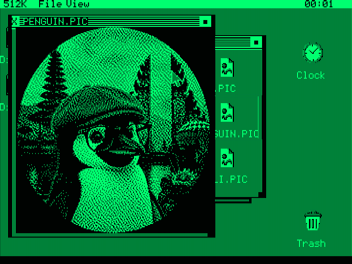
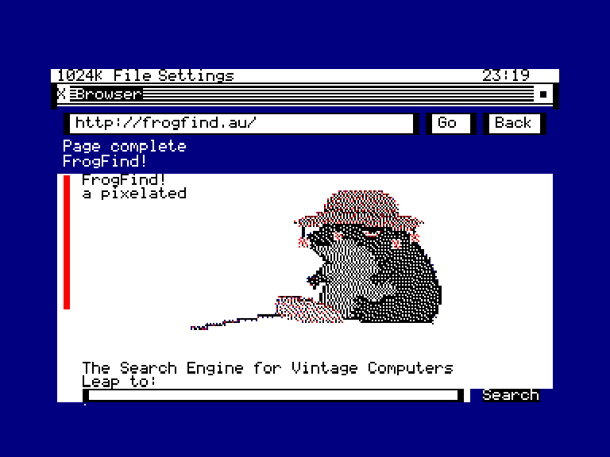
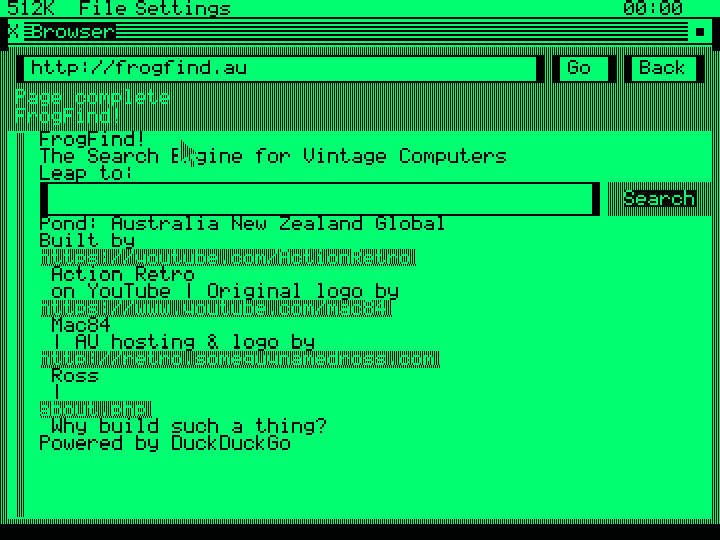

<p align="center">
  
</p>

# GEOBENCH

A graphical desktop environment for the **Amstrad CPC**, the **MSX2** and the
**Amstrad PCW** — a hybrid clone that borrows the best ideas from **Commodore
GEOS** (C64/C128) and the **Amiga Workbench**, reimagined for 8-bit Z80
hardware.


*The GEOBENCH desktop on the **Amstrad CPC** — file manager, picture viewer and clock.*


*The same desktop on the **MSX2** (V9938 Screen 6).*



*The standalone **Amstrad PCW** port, shown in the 1985 emulator's monochrome
green display mode.*

A resident Z80 **kernel** owns the machine and exposes a fixed jump-table API; the
**apps are written in C** (SDCC) and run co-resident in expansion-bank pages,
reaching the kernel through `libgb`. It's a graphical layer on top of an existing
DOS (AMSDOS / UniDOS / MSX-DOS 2), not a replacement OS — smaller scope than
[SymbOS](https://www.symbos.de), different goal.

The desktop, file tools and graphical Shell build for all targets from the same
source tree. The CPC and PCW distributions also ship Telnet, network diagnostics,
the graphical WGET HTTP downloader, and a working streaming HTTP browser with
links, GET search forms, and proxy-converted inline pictures; PCW networking
uses PerryFi/PerryNet.

<p align="center">
  
  
</p>

*The GEOBENCH Browser on the **Amstrad CPC** (left, showing several pages through
GB-proxy) and **Amstrad PCW** (right).*

Targets:
the CPC (Albireo/M4 card + AMSDOS floppy), the [MSX2](docs/MSX2.md)
(MSX-DOS 2 / Nextor, V9938 Screen 6) and the [Amstrad PCW](docs/PCW.md)
(8256/8512 — boots standalone from its own boot sector, CGA2 colour in the
1985 emulator).

## Quick start

The ready-to-run media is committed under `QA/` — no build needed. Copy it to real
hardware, or use the disk images in an emulator.

### Amstrad CPC

- **Albireo / M4 card** — copy the **contents of [`QA/CPC/CARD/`](QA/CPC/CARD)** onto the
  root of the card (an Albireo SD card, or an M4 card). On the CPC type `RUN"GB` —
  the loader detects the board and boots the right kernel. The picture gallery is
  in `PICS/`; standalone diagnostics are in `DIAG/`.
- **Floppy** — write **`QA/CPC/Floppies/GEOBENCH.DSK`** (the main disk) and
  **`QA/CPC/Floppies/COMPANION.DSK`** (the larger apps and extra savers) to the
  working disk set. **`QA/CPC/Floppies/EXTRAS.DSK`** holds the complete picture
  gallery. It is an extended
  80-track data image for a Gotek/emulator or compatible drive because the gallery
  does not fit a 180K CF2. Boot with `RUN"GB` (or `RUN"GBKERN`).

### MSX2

- Copy the **contents of [`QA/MSX/`](QA/MSX)** onto storage your MSX-DOS 2 / Nextor
  setup mounts (SD, IDE, …) and run **`GBMSX.COM`** — or use it in an emulator such
  as openMSX (see [docs/MSX2.md](docs/MSX2.md)). Pictures are under `PICS/` and
  development diagnostics under `DIAG/`.

### Amstrad PCW

- Boot **`QA/PCW/GEOBENCH.DSK`** on a real PCW 8256/8512 (e.g. from a Gotek) or
  in the [1985 emulator](docs/PCW.md) with `video_mode = cga2` and the
  DK'tronics board enabled (`debug/1985-pcw.conf`); **`QA/PCW/COMPANION.DSK`**
  contains backdrops and network apps, while **`QA/PCW/EXTRAS.DSK`** is the 720K
  picture gallery and carries GB-PAINT, GB-BASIC, BASIC examples, and additional
  PCW-compatible screensavers. No CP/M is needed — the disc boots GEOBENCH directly. Real machines show the native 1bpp monochrome; the CGA2
  colours are an emulator feature (see [docs/PCW.md](docs/PCW.md)).
- On real PCW hardware, automatic desktop time sync uses a PerryFi card running
  PerryNet firmware. Enable it with `TIMESYNC=true` and set the local whole-hour
  UTC offset with `TIMEZONE=+H` or `TIMEZONE=-H` in `GEOBENCH.CFG`; see
  [docs/PCW.md](docs/PCW.md).

### Browser proxy

The optional [GB-proxy](https://github.com/salvogendut/GB-proxy) companion makes
modern HTTPS pages practical for the CPC and PCW Browser. It simplifies HTML,
shortens destination URLs, and converts web images into bounded four-colour
GBPC pictures:

```shell
git clone https://github.com/salvogendut/GB-proxy.git
cd GB-proxy
cp config.py.example config.py
```

Set `PRESET = "geobench"` in `config.py`, then start it:

```shell
./start_macproxy.sh --port=5001
```

In `BROWSER.APP`, open **Settings > Proxy** and enter
`http://127.0.0.1:5001` when the emulator and proxy run on the same computer.
Real CPC/PCW hardware must use the proxy computer's LAN address, for example
`http://192.168.1.10:5001`. The value is persisted as `PROXY=` in
`GEOBENCH.CFG`. GB-proxy serves plain HTTP to the 8-bit client, so run it only
on a trusted network and do not use it for sensitive accounts.

Building from source is for developers — see [docs/BUILDING.md](docs/BUILDING.md).

## Documentation

- **[About](docs/ABOUT.md)** — what GEOBENCH is, why, how it works, design
  inspirations, target hardware, goals and non-goals, project layout.
- **[Features](docs/FEATURES.md)** — what works today, with screenshots.
- **[Building & running](docs/BUILDING.md)** — the CPC build, deploy targets, the
  optional GEOBENCH ROM.
- **[The MSX2 target](docs/MSX2.md)** — the second platform: `GBMSX.COM`, Screen 6,
  the openMSX harness.
- **[Portable picture format](docs/PIC_FORMAT.md)** — the byte-identical GBPC v2
  payload shared by CPC, MSX2, and PCW.
- **[Roadmap](docs/ROADMAP.md)** — what's done and what's next.

## Where it's going

The core desktop, windowing, file manager, C app model and most bundled apps work
across the three targets. Network apps run on CPC and PCW; MSX networking remains
future work. Next up: resizable and scrollable Paint canvases, drawers/folders,
and configuration panels for more screensavers. See the
[roadmap](docs/ROADMAP.md) for the full list.

## License

BSD 3-Clause License. See [`LICENSE`](LICENSE).
