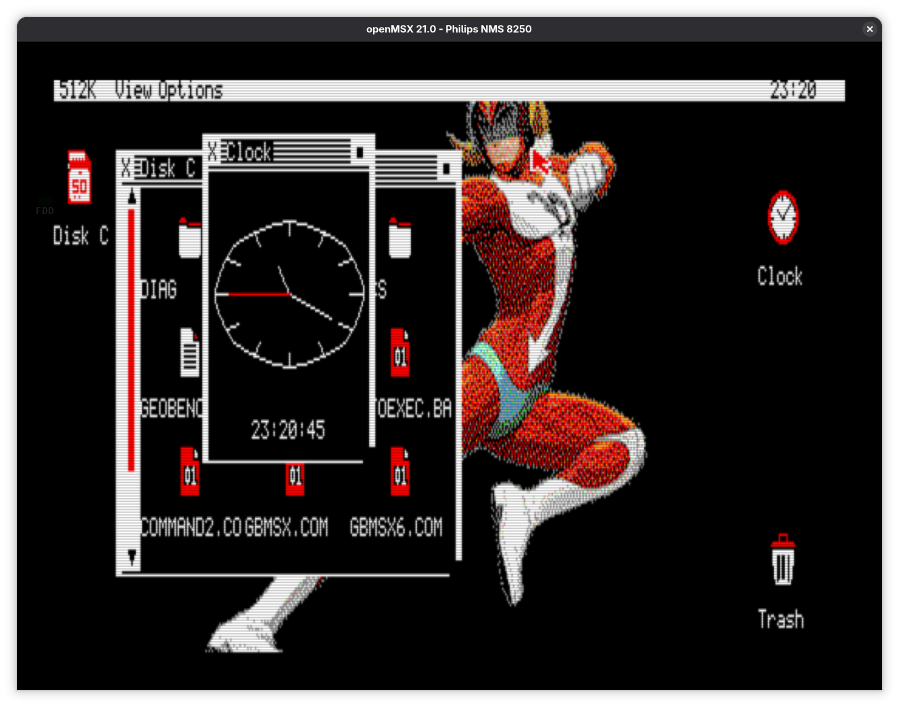

# GEMBENCH

GEMBENCH is a native evolution of GeoBench for the Omega MSX2. It combines
GeoBench's Z80 kernel, banked application model, and hardware backends with the
declarative resources and consistent desktop conventions associated with
Digital Research GEM.

This is not an x86 GEM emulator, an AES compatibility layer, or a loader for
historical GEM applications. GEMBENCH borrows interaction and architecture
ideas while retaining a native Z80 ABI and independently implemented BSD code
and artwork.



## Status

The repository now contains the complete GeoBench foundation, imported with
history from upstream commit `6309ff3`. The bootstrap intentionally preserves
the existing runtime and applications before GEMBENCH-specific UI changes are
introduced.

The first proof of concept covers:

- a compact, bank-safe `.GBR` resource format;
- object-tree drawing, hit testing, and state changes;
- window-kind flags and standard window-manager messages;
- one resource-driven dialog; and
- a coherent sixteen-colour Screen 7 theme.

## Fixed target

- Omega MSX2 at approximately 3.58 MHz
- 512 KiB mapper RAM
- V9938 or V9958 with 128 KiB VRAM
- Screen 7 at 512 x 212 with sixteen colours
- MSX-DOS2 or Nextor
- RainBIOS as a supported validation environment

CPC and PCW sources are retained during bootstrap, but compatibility with those
machines does not constrain new GEMBENCH APIs, resources, or layouts.

## Build and check

Run the host checks, including the GBR compiler suite and example build:

```sh
make check
```

Build the fixed-target MSX distribution:

```sh
make gembench-msx
```

Capture the reproducible pre-GBR baseline under the sibling `1983`
emulator checkout:

```sh
make gembench-baseline-1983
```

The inherited GeoBench build requires RASM, SDCC, mtools, dosfstools, and the
documented MSX dependencies. See [Building and running](docs/BUILDING.md) and
[the MSX2 target](docs/MSX2.md) for setup, deployment, and emulator commands.

Compile a resource directly with:

```sh
python3 tools/gbrc.py examples/hello-dialog.json \
    --output build/examples/hello-dialog.gbr
```

## Documentation

- [Design and estimate](DESIGN-ESTIMATE.md)
- [Approved implementation plan](docs/gembench/IMPLEMENTATION-PLAN.md)
- [Bootstrap validation results](docs/gembench/BOOTSTRAP-RESULTS.md)
- [Current MSX2 baseline](docs/gembench/BASELINE.md)
- [Baseline measurement workflow](docs/gembench/DEVELOPMENT.md)
- [GEMBENCH architecture](docs/gembench/ARCHITECTURE.md)
- [GBR version 1](docs/GBR-V1.md)
- [GeoBench foundation architecture](docs/ARCHITECTURE.md)
- [Development workflow](docs/DEVELOPMENT.md)

## Upstream

GeoBench history is retained in this repository. Developers can configure the
upstream remote with:

```sh
git remote add upstream git@github.com:salvogendut/geobench.git
git fetch upstream
```

The exact bootstrap base and reproduction procedure are recorded in
[the upstream baseline](docs/gembench/UPSTREAM.md).

## Licensing

GEMBENCH is released under the [BSD 3-Clause License](LICENSE), matching
GeoBench. OpenGEM and FreeGEM remain GPL-licensed references: GEMBENCH behaviour,
code, artwork, and resources must be independently implemented unless separately
reviewed compatible material carries a clear provenance record.
