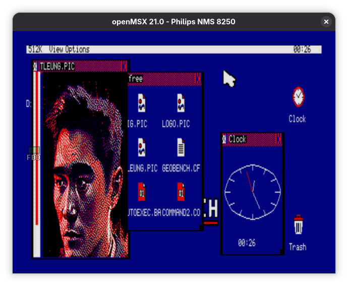

  

# GEOBENCH

A graphical desktop environment for the **Amstrad CPC**, the **MSX2** and the
**Amstrad PCW** — a hybrid clone that borrows the best ideas from **Commodore
GEOS** (C64/C128) and the **Amiga Workbench**, reimagined for 8-bit Z80
hardware.

*The GEOBENCH desktop on the **Amstrad CPC** — file manager, picture viewer and clock.*

*The same desktop on the **MSX2** (V9938 Screen 6).*

A resident Z80 **kernel** owns the machine and exposes a fixed jump-table API; the
**apps are written in C** (SDCC) and run co-resident in expansion-bank pages,
reaching the kernel through `libgb`. It's a graphical layer on top of an existing
DOS (AMSDOS / UniDOS / MSX-DOS 2), not a replacement OS — smaller scope than
[SymbOS](https://www.symbos.de), different goal.

The desktop, file tools and graphical Shell build for all targets from the same
source tree. The CPC and PCW distributions also ship Telnet, network diagnostics,
the graphical WGET HTTP downloader, and a small streaming HTTP browser; PCW
networking uses PerryFi/PerryNet. Targets:
the CPC (Albireo/M4 card + AMSDOS floppy), the [MSX2](docs/MSX2.md)
(MSX-DOS 2 / Nextor, V9938 Screen 6) and the [Amstrad PCW](docs/PCW.md)
(8256/8512 — boots standalone from its own boot sector, CGA2 colour in the
1985 emulator).

## Quick start

The ready-to-run media is committed under `QA/` — no build needed. Copy it to real
hardware, or use the disk images in an emulator.

### Amstrad CPC

- **Albireo / M4 card** — copy the **contents of [`QA/CARD/`](QA/CARD)** onto the
  root of the card (an Albireo SD card, or an M4 card). On the CPC type `RUN"GB` —
  the loader detects the board and boots the right kernel.
- **Floppy** — write **`QA/GEOBENCH.DSK`** (the main disk) and
  **`QA/COMPANION.DSK`** (the larger apps, extra savers and sample pictures, for
  drive B) to two 3″ disks, or open the `.DSK` images in a CPC emulator (Caprice32,
  WinAPE, …). Boot with `RUN"GB` (or `RUN"GBKERN`).

### MSX2

- Copy the **contents of [`QA/MSX/`](QA/MSX)** onto storage your MSX-DOS 2 / Nextor
  setup mounts (SD, IDE, …) and run **`GBMSX.COM`** — or use it in an emulator such
  as openMSX (see [docs/MSX2.md](docs/MSX2.md)).

### Amstrad PCW

- Boot **`QA/PCW/GEOBENCH.DSK`** on a real PCW 8256/8512 (e.g. from a Gotek) or
  in the [1985 emulator](docs/PCW.md) with `video_mode = cga2` and the
  DK'tronics board enabled (`debug/1985-pcw.conf`); **`QA/PCW/COMPANION.DSK`**
  (pictures, backdrops and network apps) goes in drive B. No CP/M is needed — the disc boots
  GEOBENCH directly. Real machines show the native 1bpp monochrome; the CGA2
  colours are an emulator feature (see [docs/PCW.md](docs/PCW.md)).
- On real PCW hardware, automatic desktop time sync uses a PerryFi card running
  PerryNet firmware. Enable it with `TIMESYNC=true` and set the local whole-hour
  UTC offset with `TIMEZONE=+H` or `TIMEZONE=-H` in `GEOBENCH.CFG`; see
  [docs/PCW.md](docs/PCW.md).

Building from source is for developers — see [docs/BUILDING.md](docs/BUILDING.md).

## Documentation

- **[About](docs/ABOUT.md)** — what GEOBENCH is, why, how it works, design
  inspirations, target hardware, goals and non-goals, project layout.
- **[Features](docs/FEATURES.md)** — what works today, with screenshots.
- **[Building & running](docs/BUILDING.md)** — the CPC build, deploy targets, the
  optional GEOBENCH ROM.
- **[The MSX2 target](docs/MSX2.md)** — the second platform: `GBMSX.COM`, Screen 6,
  the openMSX harness.
- **[Roadmap](docs/ROADMAP.md)** — what's done and what's next.

## Where it's going

The core desktop, windowing, file manager, C app model and most bundled apps work
across the three targets. Network apps run on CPC and PCW; MSX networking remains
future work. Next up: a single
canonical asset format shared across CPC and MSX, resizable Paint canvases,
drawers/folders, and per-screensaver configuration. See the
[roadmap](docs/ROADMAP.md) for the full list.

## License

BSD 3-Clause License. See [`LICENSE`](LICENSE).
