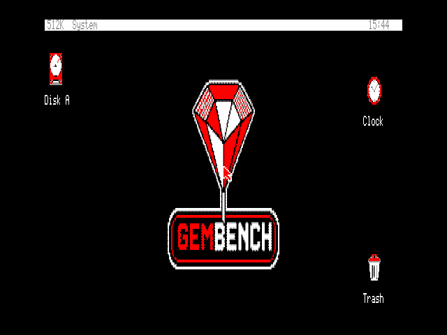

# GEMBENCH

GEMBENCH is a native evolution of GeoBench for the Omega MSX2. It combines
GeoBench's Z80 kernel, banked application model, and hardware backends with the
declarative resources and consistent desktop conventions associated with
Digital Research GEM.

This is not an x86 GEM emulator, an AES compatibility layer, or a loader for
historical GEM applications. GEMBENCH borrows interaction and architecture
ideas while retaining a native Z80 ABI and independently implemented BSD code
and artwork.



## Status

The repository contains the complete GeoBench foundation, imported with history
from upstream commit `6309ff3`, plus the first GEMBENCH-specific visual layer:
an MSX2-only black, white, grey, and red base palette with original boot and
desktop logo assets. The measured pre-theme runtime baseline remains recorded
for comparison.

The completed foundation currently covers:

- a compact, bank-safe `.GBR` resource format and deterministic host compiler;
- strict host and allocation-free Z80 validation of resource binaries;
- bounded lookup and navigation of strings, trees, and objects;
- an app-linked Screen 7 runtime for box, text/string, and button objects;
- caller-owned state overlays plus deepest-selectable-object hit testing;
- an MSX2 File Manager association and external `HELLO.GBR` demonstration;
- source-only object IDs, deterministic C-header generation, field objects,
  live text bindings, and cyclic keyboard focus;
- an MSX2 FormRef dialog whose drawing and hit geometry come from embedded GBR;
- a measured MSX2 auxiliary-resource prototype and resident-renderer fit probe,
  with the smaller embedded/app-linked placement retained for GBR v1;
- explicitly versioned MSX2 window kinds with kernel-owned furniture, move, resize, and
  maximise/restore gestures, demonstrated by File Manager;
- a machine-checked GEMBENCH-1 freeze for the GBR1 and managed-window ABIs;
- committed golden data and corruption tests; and
- an MSX2-only black, white, grey, and red Screen 7 visual foundation.

The first resource and managed-window ABI is frozen. New incompatible resource
or window work must cross an explicit version boundary.

## Fixed target

- Omega MSX2 at approximately 3.58 MHz
- 512 KiB mapper RAM
- V9938 or V9958 with 128 KiB VRAM
- Screen 7 at 512 x 212 with sixteen colours
- MSX-DOS2 or Nextor
- RainBIOS as a supported validation environment

CPC and PCW sources are retained during bootstrap, but compatibility with those
machines does not constrain new GEMBENCH APIs, resources, or layouts.

## Build and check

Run the host checks, including the GBR compiler suite and example build:

```sh
make check
```

Build the fixed-target MSX distribution:

```sh
make gembench-msx
```

To exercise the object runtime, open the first desktop drive and double-click
`HELLO.GBR` in its root. File Manager launches `GBRDEMO.APP`, which validates
the external resource, draws its `HELLO` tree, and toggles the button's selected
state when it is clicked.

Build and automatically exercise the embedded FormRef resource in openMSX:

```sh
make formref
tools/test_formref_openmsx.sh
```

Exercise File Manager's GEM-style window kind, including kernel-owned
maximise/restore, move, resize, and geometry messages:

```sh
tools/test_window_kinds_openmsx.sh
```

Capture the reproducible pre-GBR baseline under the sibling `1983`
emulator checkout:

```sh
make gembench-baseline-1983
```

Add diagnostic-only scheduler stack and repaint measurements with:

```sh
make gembench-baseline-probes-1983
```

The probe target preserves release artifact measurements in the report and
does not add instrumentation to normal GEMBENCH builds.

Complete the baseline with input-response measurements under three runnable
tasks, using openMSX for the reference pointer result:

```sh
make gembench-baseline-input-1983
make gembench-baseline-input-openmsx
```

The inherited GeoBench build requires RASM, SDCC, mtools, dosfstools, and the
documented MSX dependencies. See [Building and running](docs/BUILDING.md) and
[the MSX2 target](docs/MSX2.md) for setup, deployment, and emulator commands.

Compile a resource directly with:

```sh
python3 tools/gbrc.py examples/hello-dialog.json \
    --output build/examples/hello-dialog.gbr
```

## Documentation

- [Design and estimate](DESIGN-ESTIMATE.md)
- [Approved implementation plan](docs/gembench/IMPLEMENTATION-PLAN.md)
- [Bootstrap validation results](docs/gembench/BOOTSTRAP-RESULTS.md)
- [Current MSX2 baseline](docs/gembench/BASELINE.md)
- [Milestone 7 banking decision](docs/gembench/M7-BANKING-DECISION.md)
- [Frozen GEMBENCH-1 ABI](docs/gembench/ABI-V1.md)
- [openMSX reference validation](docs/gembench/OPENMSX-VALIDATION.md)
- [Baseline measurement workflow](docs/gembench/DEVELOPMENT.md)
- [Visual direction and base palette](docs/gembench/VISUAL-DIRECTION.md)
- [GEMBENCH architecture](docs/gembench/ARCHITECTURE.md)
- [GBR version 1](docs/GBR-V1.md)
- [GeoBench foundation architecture](docs/ARCHITECTURE.md)
- [Development workflow](docs/DEVELOPMENT.md)

## Upstream

GeoBench history is retained in this repository. Developers can configure the
upstream remote with:

```sh
git remote add upstream git@github.com:salvogendut/geobench.git
git fetch upstream
```

The exact bootstrap base and reproduction procedure are recorded in
[the upstream baseline](docs/gembench/UPSTREAM.md).

## Licensing

GEMBENCH is released under the [BSD 3-Clause License](LICENSE), matching
GeoBench. OpenGEM and FreeGEM remain GPL-licensed references: GEMBENCH behaviour,
code, artwork, and resources must be independently implemented unless separately
reviewed compatible material carries a clear provenance record.
