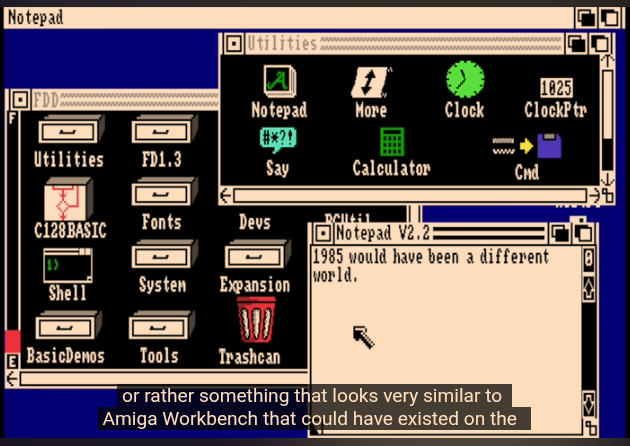
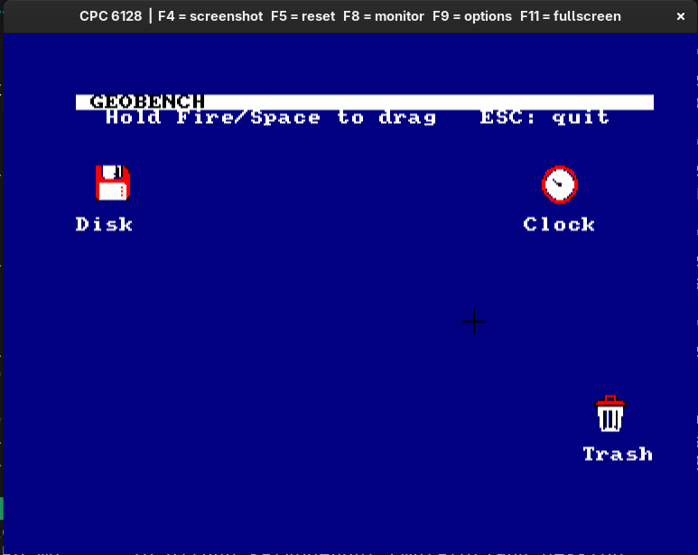

# GEOBENCH

A graphical desktop environment for the **Amstrad CPC** — a hybrid clone that
borrows the best ideas from **Commodore GEOS** (C64/C128) and the **Amiga
Workbench**, reimagined for 8-bit Z80 hardware.

> **Status:** early but running. The desktop boots in Mode 1 and has a
> save-under mouse pointer (keyboard + joystick), plus draggable icons
> (Workbench-style outline drag). See `desktop/` and `lib/`.

## Visual target

The long-term look we're aiming for — an Amiga Workbench-style desktop as it
might have existed on the CPC: labelled drawer/app icons, windows with title
bars and gadgets, a trashcan, an arrow pointer.



> Image: a screenshot from The 8-Bit Guy's video on the **C128 "Alternate
> Universe"** — used here purely as a visual reference for the look we're after.

We're a long way from this, but it's the north star.

### Where it is now

This is the current GEOBENCH desktop running on the Amstrad CPC (1984 emulator):
a Mode 1 backdrop with a title bar and draggable multicolour bitmap icons
(Disk, Clock, Trash) with labels, driven by a keyboard/joystick pointer.



> The initial status — a long way to go, but the foundations (fast bitmap
> blitting, icons, drag-and-drop) are in place.

## What is this?

The Amstrad CPC shipped with Locomotive BASIC and AMSDOS: a perfectly capable
8-bit machine that never got a first-class graphical operating environment the
way the C64 did with GEOS or the Amiga did with Workbench/Intuition.

GEOBENCH aims to fill that gap. The goal is a mouse-and-icon desktop that feels
familiar to anyone who used a 16-bit Amiga, but runs within the constraints of
a 64K–128K CPC.

### Why "GEOBENCH"?

**GEO**S + Work**BENCH**. Two of the most influential desktop metaphors of the
8/16-bit era, fused into one name.

### What about SymbOS?

To be clear up front: a genuine first-class, multitasking, windowed operating
system **already exists** for the Amstrad CPC — [**SymbOS**](https://www.symbos.de).
It is a remarkable engineering achievement, with preemptive multitasking, a full
window manager, and its own application ecosystem.

GEOBENCH is **not** an attempt to copy, compete with, or reimplement SymbOS.
SymbOS is its own complete OS and is far more ambitious (and complex) than what
this project sets out to do. Instead, GEOBENCH is a much humbler thing: a
**graphical desktop layer that sits on top of an existing disk operating system**
— standard **AMSDOS**, or a more capable DOS such as **UniDOS**. It keeps the
familiar DOS underneath and adds a GEOS/Workbench-style face on top, rather than
replacing the whole system. Smaller scope, smaller footprint, different goal.

## Design inspirations

We deliberately cherry-pick from both ancestors rather than cloning either one.

### From Commodore GEOS

- **It runs on tiny hardware.** GEOS proved a real WIMP desktop is possible on a
  1 MHz 8-bit CPU with 64K of RAM. That is the existence proof GEOBENCH stands on.
- **Proportional bitmap fonts** and a consistent system look.
- **A disk-based application model** — load apps from disk on demand, keep the
  resident kernel small.
- **Bundled productivity apps** in the spirit of geoWrite / geoPaint.

### From Amiga Workbench

- **The desktop metaphor proper:** draggable icons, windows, drawers (folders),
  and a trashcan.
- **Screens and windows** as the core UI primitives.
- **A clean, layered look** that treats the desktop as a workspace, not a menu.
- **Tools and drawers** the user can arrange spatially.

## Target hardware

- **Amstrad CPC** (464 / 664 / 6128, and CPC+).
- 128K RAM strongly preferred; 64K as a stretch/minimal target.
- Standard CPC graphics modes (Mode 1 for the desktop is the likely default —
  320×200, 4 colours — balancing resolution against memory).
- **AMX-style mouse read via the joystick port** as the default pointing device,
  with keyboard fallback. This needs no expansion hardware, so the desktop runs
  on a bare CPC. The input layer stays abstract so a **SYMBiFACE II / Cyboard
  PS/2 mouse** can be added later for machines that have the board.
- Floppy / disk-based; networking via Net4CPC (W5100S) is a possible future
  extension — see the related `n4c-nettools` project.

## Goals

- A resident **kernel** small enough to leave usable RAM for applications.
- A **desktop shell**: icons, windows, drawers, drag-and-drop, menus.
- A **graphics + windowing layer** abstracting the CPC's video hardware.
- A **mouse/input layer** with a software pointer.
- A small set of **bundled applications** to prove the platform is real.
- A documented **application API** so third parties can write GEOBENCH apps.
- **Launching existing software.** Because GEOBENCH sits on top of AMSDOS/UniDOS
  rather than replacing it, the desktop should be able to run the CPC's existing
  catalogue — pick a `.BIN` binary or a BASIC `.BAS` program from an icon and
  launch it, the same way you would `RUN"PROG"` from the BASIC prompt today. This
  makes the existing disk library immediately useful from the desktop instead of
  requiring everything to be rewritten as a native GEOBENCH app.

## Running existing AMSDOS software

A core part of the "layer on top of DOS, don't replace it" philosophy:

- **AMSDOS binaries (`.BIN`)** — the desktop hands the file off to the firmware
  loader (RSX/`|`-style or direct CAS/AMSDOS calls) and transfers control, just
  as typing `RUN"GAME.BIN"` would.
- **BASIC programs (`.BAS`)** — launched via the BASIC ROM, equivalent to
  `RUN"PROG"`.

When launching, the user chooses how the program runs:

- **Fullscreen** — the program takes over the whole machine. This is the safe,
  always-works mode: most CPC software assumes it **owns the machine** (full
  memory, its own video mode, direct hardware access), so GEOBENCH **steps
  aside** — it parks (or tears down) its own state, hands the program the
  machine, and the user returns to the desktop afterwards (on program exit /
  reset). "Launch and hand over the machine."
- **Windowed** — where feasible, run the program's output inside a desktop
  window so it coexists with the rest of the desktop. This is the harder,
  best-effort mode and won't work for every title: programs that bang the
  hardware directly, switch video mode, or claim memory GEOBENCH needs can't be
  contained. Realistic candidates are well-behaved BASIC programs and software
  that confines itself to the firmware. The desktop should fall back to (or warn
  about) fullscreen when a program can't be safely windowed.

A future, friendlier class of **GEOBENCH-native apps** (see the application API)
is designed to cooperate and always run inside the desktop — the windowed/
fullscreen choice above is specifically about coaxing *legacy* `.BIN`/`.BAS`
software into the environment.

## Non-goals (for now)

- Multitasking / preemptive scheduling (the Amiga's killer feature, but a heavy
  lift on a Z80 — cooperative or single-app-at-a-time is the realistic start).
- Hard compatibility with actual GEOS or Workbench binaries. GEOBENCH is
  *inspired by* them, not a binary-compatible reimplementation.
- 100% feature parity with either ancestor.

## Tech notes

- **CPU:** Zilog Z80.
- **Language:** Z80 assembly (assembler TBD — RASM is used in sibling projects).
- **Constraints:** every byte and every cycle counts. The architecture has to
  respect a ~4 MHz CPU and a banked 128K memory map.

## Project layout (planned)

```
geobench/
├── README.md          # this file
├── docs/              # design docs, architecture, UI mockups
├── kernel/            # resident OS kernel
├── desktop/           # the Workbench-style shell
├── lib/               # graphics, window, input, font libraries
├── apps/              # bundled applications
└── tools/             # host-side build/asset tooling
```

(Directories will appear as the corresponding pieces get built.)

## Roadmap (rough)

1. **Boot + bare desktop** — clear screen, draw a desktop, show a mouse pointer.
2. **Windowing** — open/close/move windows.
3. **Icons + drawers** — represent files and folders, drag them around.
4. **Menus + a file manager** — make the desktop actually do something.
5. **App API + first bundled app** — prove an application can run on top.

## License

TBD.
