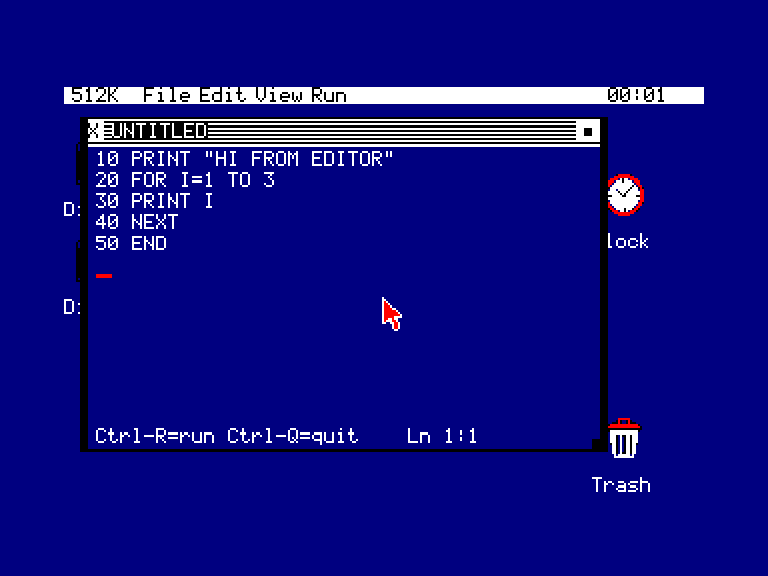

# GB-BASIC

A small **GW-BASIC-flavoured BASIC** bundled with [GEMBENCH](../..) for the
Amstrad CPC, MSX2 and Amstrad PCW. GB-BASIC is two co-operating desktop apps:

- **BASIC.APP** — the program editor (GEOBENCH's Notepad, adapted for `.BAS`),
  with a **Run** menu.
- **BASRUN.APP** — the runtime: a 40×20 character console window that runs your
  program, with GW-style floating point and 240×160 four-colour graphics.



Numbers are full floating point (Microsoft Binary Format single, like GW-BASIC's
`SNG`); graphics draw directly into the runtime window.

## Quick start (Amstrad CPC)

You need a GEMBENCH boot disk and the optional standalone GB-BASIC data disk:

1. Put the GEMBENCH CPC system disk in **drive A**.
2. Put **`dist/GBBASIC.DSK`** in **drive B**.
3. Boot GEMBENCH (`RUN"GB`). On the desktop, double-click **Disk B**.
4. Double-click **BASIC.APP**. Type a program (or File → Load one of the
   examples), then pick **Run** from the menu (or press **Ctrl-R**).
5. The program runs in a new console window. Press a key when it finishes to
   close it.

> **128K CPC note:** a stock 128K machine has room for only two app windows
> besides the desktop. Close the **File Manager** window before you Run, or use
> a 192K+ machine (the dev emulator runs 512K). If there's no room, Run says so
> instead of failing silently.

Both apps and the examples ride the one drive-B data disk; no installation onto
the GEOBENCH disk is needed.

## Quick start (MSX2)

Mount **`dist/GBBASIC-MSX.DSK`** as a disk alongside your GEMBENCH MSX image,
open it in the File Manager, and run **BASIC.APP** the same way. MSX needs a
machine with enough mapper RAM for the extra windows (the project tests 512K).

> **Keep the disk's files in one directory.** BASRUN loads its `BASRUN2.BIN`
> overlay from the **current directory** (MSX has subdirectories; the CPC floppy
> is flat). `GBBASIC-MSX.DSK` ships `BASRUN2.BIN` in the root next to the apps
> and examples, so launching from the disk root just works. If you copy programs
> into a subfolder, copy `BASRUN2.BIN` alongside them (or run from the root).

## Quick start (Amstrad PCW)

Boot **`../../QA/PCW/Floppies/GEOBENCH.DSK`** in the PCW emulator or on PCW
hardware and mount **`dist/GBBASIC-PCW.DSK`** in drive B. Open Disk B in the
File Manager and run **BASIC.APP**. The PCW disk is a flat CF2 CP/M data disk,
so the apps, `BASRUN2.BIN`, and examples all live in the root directory.

## The language

See **[docs/LANGUAGE.md](docs/LANGUAGE.md)** for the full statement and function
reference and the (small, documented) deviations from GW-BASIC. In brief:

- Line-numbered programs; `PRINT` (`;` `,` `TAB`), `INPUT`, `LET`/implied `LET`.
- `IF … THEN … ELSE`, `FOR`/`NEXT`/`STEP`, `GOTO`, `GOSUB`/`RETURN`, `STOP`/`END`.
- `DIM` (1-D numeric arrays), `DATA`/`READ`/`RESTORE`.
- Numeric: `ABS SGN INT SQR SIN COS TAN RND`, operators `+ - * / ^ MOD` and
  `AND OR NOT`, relationals yielding `-1`/`0`.
- Strings: `A$`, `+` concatenation and comparison; `LEN ASC CHR$ LEFT$ RIGHT$
  MID$ INKEY$`.
- Graphics (240×160, pens 0–3): `CLS`, `LOCATE`, `COLOR`, `PSET`, `LINE`
  (`,B`/`,BF`), `CIRCLE`.

## Examples (`examples/`)

| File | Shows |
|------|-------|
| `HELLO.BAS`  | `PRINT`, `FOR`, `TAB` |
| `GUESS.BAS`  | `INPUT`, `RND`, `IF`, `GOTO` |
| `PRIMES.BAS` | nested `FOR`, `MOD` |
| `ART.BAS`    | `LINE`, `CIRCLE`, boxes, `COLOR` |
| `CHASE.BAS`  | `INKEY$`, `PSET` (move a dot with the keyboard) |

## Building from source

Needs `rasm`, `sdcc` (with `sdasz80`/`sdldz80`/`makebin`), and — for the MSX
disk — `mkfs.fat` + `mtools`. The PCW disk builder uses GEMBENCH's
`tools/mkpcwdsk.py`. Run these commands from this component directory; the
default `GEOBENCH=../..` compiles against the enclosing checkout's shared
`lib/gb` without modifying it.

```bash
make cpc     # dist/GBBASIC.DSK   (CPC drive-B data disk)
make msx     # dist/GBBASIC-MSX.DSK
make pcw     # dist/GBBASIC-PCW.DSK
make all     # all supported targets
make qa-cpc  # build + run a smoke test in the 1984 emulator (headless)
```

`apps/basic/icon.asm` is BASIC.APP's canonical four-colour desktop icon. The
editable PNG source lives at `assets/icon.png`. The build embeds the canonical
ASM in the application's GBAP header on every platform; adding an
adjacent `icon16.asm` later supplies an optional native MSX 16-colour variant.

## How it works (and why it's two files plus an overlay)

A GEOBENCH C app runs in a single 16 KB bank (`#4000–#7FFF`) and reaches the
kernel through `lib/gb`. A full floating-point interpreter did **not** fit that
bank once SDCC's software-float library was linked, so GB-BASIC is arranged as:

- **BASRUN.APP** — the interpreter (tokeniser-free, direct from text), console,
  editor-less runtime. Its big buffers (program text, variables, console grid)
  live in the kernel's low-RAM module-transfer area, not the bank.
- **BASRUN2.BIN** — a **low-RAM overlay** holding the maths that wouldn't fit:
  a Microsoft-Binary-Format float engine (`fac.s`) and the graphics core
  (`gfx.s`), both hand-written Z80 behind a fixed jump-vector table. BASRUN
  loads it at startup; the C side calls in through tiny thunks. This is why the
  overlay must sit on the disk next to the apps.

See [`docs/LANGUAGE.md`](docs/LANGUAGE.md) and the source comments for detail.

### Frame-bounded execution

BASRUN remains a root-owned GEOBENCH application because its statements use the
window manager, graphics and input services. It keeps the desktop responsive by
executing at most 24 ordinary statements per frame. A full-program line or DATA
scan ends the current statement slice, and `LINE`, outlined/filled boxes and
`CIRCLE` advance through fixed graphics budgets over multiple frames. Ctrl-C and
the close gadget remain active while a graphics operation is in progress.

The remaining expression, DIM, string and INPUT loops are bounded by the fixed
capacities listed in the language reference.

## Caveat: program buffer shares kernel low RAM

BASRUN parks its program, variables and console in the kernel's module
bulk-transfer buffer (`0x2200–0x3DFF`). That region is idle while a program
runs, **except** during File-Manager file copies/saves performed by *other*
windows at the same time — doing that while a GB-BASIC program is running can
disturb it. Don't copy files in another window mid-run.

## License

The editor is derived from GeoBench's Notepad. This component is distributed
under GEMBENCH's BSD-3-Clause license; see [LICENSE](LICENSE) and
[PROVENANCE.md](PROVENANCE.md).
