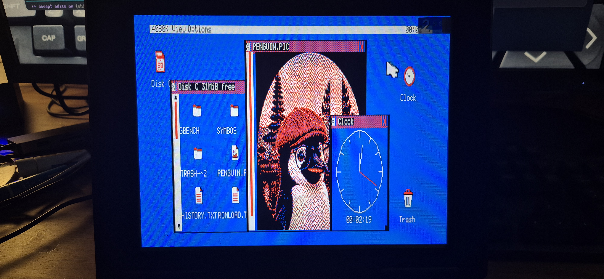

# The MSX2 target

The same OS, cross-built for the MSX2 (issue #287). It is **one source tree, two
platforms**: the resident kernel assembles from the same `kernel/` sources under
`-DPLATFORM_MSX`, and the apps compile from the same `main.c` files under
`-DGB_MSX2` — the platform differences live in the kernel's video/input/storage
back-ends, not in the apps.

GEOBENCH on real MSX2 hardware (a 1chipMSX / "1chipbook", 4080K detected): the
desktop with the File Manager, the Viewer showing `PENGUIN.PIC`, and the analog
Clock — all co-resident under the kernel window manager on a V9938 Screen 6.



- **Runs under MSX-DOS 2 / Nextor** as a plain `GBMSX.COM` executable — no custom
  boot ROM. Storage goes through BDOS file calls, so anything Nextor mounts
  (Sunrise IDE, SD interfaces, …) works.
- **Video:** V9938 **Screen 6** (512×212, 4 colours) — the closest analogue of the
  CPC's Mode 1 — with a **hardware sprite pointer** and VDP-command drawing
  (`GB_SETINK` palette mapping, `GB_LINE`).
- **Input:** joystick / keyboard pointer, plus the standard **MSX mouse** (GTPAD).
  The clock is 50/60 Hz aware.
- **Ported so far:** Desktop, File Manager, Notepad, Settings, ICONED, Paint,
  Viewer (with a Screen-6 `.PIC` pipeline), Shell, XAOS, Clock, and **all 16
  screensavers**. Telnet, NETTEST, WGET and Browser are not built for MSX yet
  because GEOBENCH does not have an MSX network transport.
- **Assets:** the icon sets, backdrops and pictures under `assets/` are packaged
  for both platforms automatically — the build transcodes each to Screen 6, so a
  file dropped into `assets/` ships on the CPC and the MSX distro alike. MSX
  pictures are staged once under root-level `PICS/`; development diagnostics such
  as `GBSPIKE.COM` are kept separately under root-level `DIAG/`.

Build and test in **openMSX** (emulating a Philips NMS 8250 with the Sunrise IDE
Nextor extension and a 512K RAM expansion):

```bash
bash tools/fetch_msx_deps.sh       # one-time: Nextor system files + NMS 8250 ROMs
bash tools/build_kernel_msx.sh     # GBMSX.COM + QA/MSX staging + bootable QA/GBMSX.IMG
tools/run_msx.sh                   # interactive session
MSX_SHOTS="25 40" tools/run_msx.sh # headless: screenshots into build/msx/
```

`run_msx.sh` uses a native `openmsx` from `$PATH`, the Flatpak
(`org.openmsx.openMSX`) as a fallback, or an explicit `OPENMSX="…"` override.
